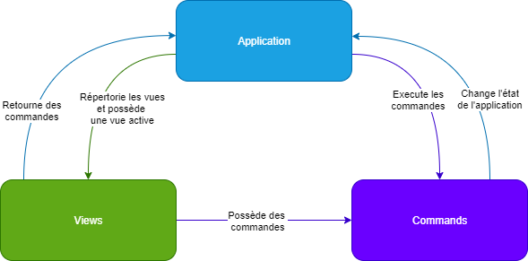
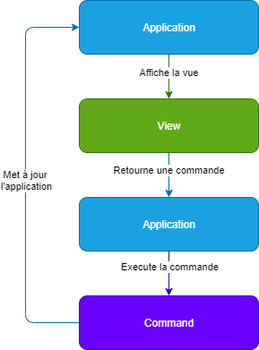

# MVC architecture

Example of MVC architecture, which uses the Strategy and the Command pattern. The model is rather simple, and handles data recovery.

> **Note:** a more complex architecture, it may be necessary to decouple the data recovery from the model.

## Install

This application uses the python `3.X` version.

```bash
python3 -m venv .venv # or py -3 -m venv .venv on windows
. .venv/bin/activate # or . .venv/Scripts/activate on windows
pip install -r requirements.txt
```

> **Note:** the virtual environment is only useful for development purposes.

## Usage

```bash
python3 main.py # or py -3 main.py on windows
```

## Explanations

In terms of dependencies, the `Application` class has access to `views` and `commands`. The `view` knows the `commands`, and the `commands` know the `Application`.

<div style="text-align:center"></div>

The sequencing is simple: the `Application` displays the `view`, and the `view` returns a `command`, and the `command` updates the `Application`.

<div style="text-align:center"></div>
